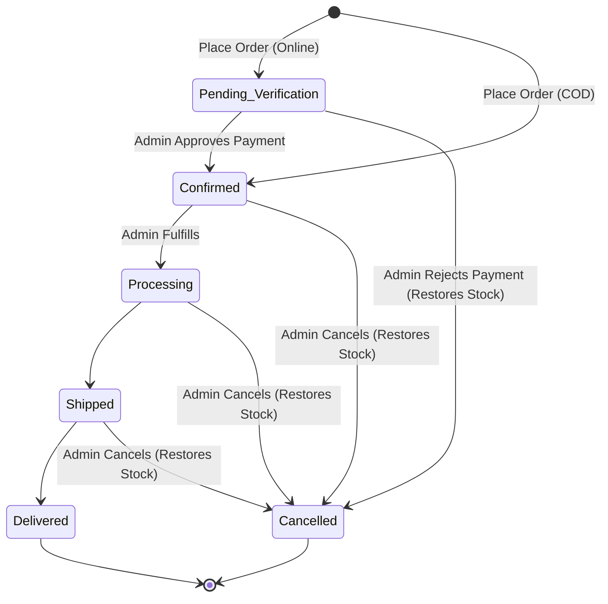
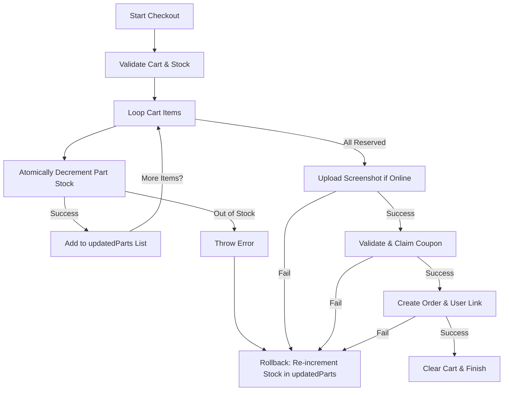

# Order Processing, Inventory & Payment Verification Workflows

This document details the core transactional workflows of the Samridhi Enterprises e-commerce platform. These systems are designed to ensure stock integrity under high concurrency, guide orders through strict payment verification, and allow administrators to manage order fulfillment.

---

## 1. Order Lifecycle

The system supports two payment methods: **Cash on Delivery (COD)** and **Online (UPI)**. An order's progression depends entirely on this choice.

### State Transitions



### Flow Types

#### A. Cash on Delivery (COD) Flow
COD orders bypass payment verification.
1. The customer places the order.
2. The system checks stock, reserves inventory, snapshots the cart, and immediately marks the order as:
   - `paymentStatus`: `Pending`
   - `orderStatus`: `Confirmed`
3. A confirmation email with the invoice is dispatched to the customer.
4. The admin fulfills the order through standard states (`Processing` → `Shipped` → `Delivered`).

#### B. Online (UPI) Flow
Online orders require admin verification of payment screenshots.
1. The customer uploads a screenshot of their UPI transaction and specifies their UPI reference number during checkout.
2. The order is created as:
   - `paymentStatus`: `Pending Verification`
   - `orderStatus`: `Pending Verification`
3. A notification email is sent acknowledging receipt of the order pending payment verification.
4. The admin reviews the proof in the admin dashboard:
   - **Approve**: Updates `paymentStatus` to `Success` and `orderStatus` to `Confirmed`. An invoice email is dispatched.
   - **Reject**: Updates `paymentStatus` to `Failed` and `orderStatus` to `Cancelled`. Rejection reason is saved, stock is restored, and a rejection email is dispatched.

---

## 2. Inventory Update Workflow (Concurrency & Atomicity)

To prevent overselling when multiple customers check out the same limited-stock spare parts simultaneously, the system uses atomic database updates.

### The Checkout Concurrency Pattern

1. **Pre-check Validation**:
   The system first loops over the user's cart items to check if the available stock (`Part.stock`) is sufficient. If any item is out of stock, the request is immediately rejected.
2. **Atomic Reservation**:
   Instead of using a simple read-and-modify approach (which is vulnerable to race conditions), the system atomically decrements stock directly in MongoDB:
   ```javascript
   const part = await Part.findOneAndUpdate(
     { _id: item.part._id, stock: { $gte: item.quantity } },
     { $inc: { stock: -item.quantity } },
     { new: true }
   );
   ```
   - `{ stock: { $gte: item.quantity } }` ensures the database only decrements if there is still enough stock at the exact millisecond of the write.
   - If `part` returns `null`, it means another concurrent checkout claimed the stock first. In this case, an error is thrown.

### Transaction Rollback Mechanism

Since multiple parts are reserved sequentially in a loop, a failure could occur mid-way (e.g., if one part has insufficient stock, the payment screenshot upload fails, or the coupon is invalid). To maintain database integrity, the system implements an active rollback:



In the `catch` block of [createOrder](file:///c:/Users/Rushabh%20Mahajan/Documents/GitHub/samridhi-enterprises/server/controllers/orderController.js#L24-L280), the code restores stock for all successfully deducted items:
```javascript
// Rollback any stocks we already successfully deducted
for (const updated of updatedParts) {
  await Part.findByIdAndUpdate(updated.id, { $inc: { stock: updated.quantity } });
}
// Rollback coupon usedCount
if (couponClaimed) {
  await Coupon.findByIdAndUpdate(couponClaimed._id, { $inc: { usedCount: -1 } });
}
```

---

## 3. Stock Restoration Logic

When an order is cancelled or its online payment is rejected, the reserved items must be returned to the store's inventory.

### Idempotency Safeguard
To prevent returning stock multiple times for the same order (e.g., if an admin calls the cancel endpoint twice or triggers status changes concurrently), the `Order` schema defines a `stockRestored` boolean field (defaulting to `false`).

### Restoration Execution
The stock restoration process:
1. Verifies that `order.stockRestored` is falsy.
2. Loops through `order.items`.
3. Restores stock atomically:
   ```javascript
   if (!order.stockRestored) {
     for (const item of order.items) {
       if (item.part) {
         await Part.findByIdAndUpdate(item.part, { $inc: { stock: item.quantity } });
       }
     }
     order.stockRestored = true;
   }
   ```
4. Saves the order.

This logic is executed in two places:
- [adminVerifyPayment](file:///c:/Users/Rushabh%20Mahajan/Documents/GitHub/samridhi-enterprises/server/controllers/orderController.js#L363-L371) (when action is `reject`).
- [adminUpdateOrderStatus](file:///c:/Users/Rushabh%20Mahajan/Documents/GitHub/samridhi-enterprises/server/controllers/orderController.js#L454-L462) (when status transitions to `Cancelled`).

---

## 4. Payment Verification Flow

Online orders use a manual UPI verification flow:

1. **UPI Credentials Presentation**:
   During checkout, the client fetches payment details via `GET /api/payment-settings` which returns the admin's current UPI QR code image and UPI ID.
2. **Uploading Proof**:
   The customer uploads a screenshot of the transaction. The file is uploaded through `multer` and saved on Cloudinary. The secure URL is saved in `paymentScreenshot.url` on the order.
3. **Verification**:
   An administrator invokes [adminVerifyPayment](file:///c:/Users/Rushabh%20Mahajan/Documents/GitHub/samridhi-enterprises/server/controllers/orderController.js#L315-L394) (`PUT /api/orders/admin/verify/:id`) with an action:
   - **`approve`**:
     - Sets `paymentStatus` to `Success` and `orderStatus` to `Confirmed`.
     - Records verification timestamp in `verifiedAt`.
     - Sends a confirmation email to the user containing the invoice details.
   - **`reject`**:
     - Sets `paymentStatus` to `Failed` and `orderStatus` to `Cancelled`.
     - Attaches the `rejectionReason` string.
     - Triggers stock restoration.
     - Sends a rejection notification email to the user explaining why verification failed.

---

## 5. Admin Approval & Status Transition Rules

Administrators cannot change order statuses arbitrarily. Transitions must follow strict operational guidelines enforced in [adminUpdateOrderStatus](file:///c:/Users/Rushabh%20Mahajan/Documents/GitHub/samridhi-enterprises/server/controllers/orderController.js#L420-L471).

### Valid State Transitions

The valid status paths are defined as follows:

| Current Status | Allowed Next Statuses | Notes |
| :--- | :--- | :--- |
| **Pending Verification** | `Confirmed`, `Cancelled` | Awaiting admin review of the payment screenshot. |
| **Confirmed** | `Processing`, `Cancelled` | Payment is verified (or COD), order is ready for packaging. |
| **Processing** | `Shipped`, `Cancelled` | Order is packed and handed off to delivery/logistics. |
| **Shipped** | `Delivered`, `Cancelled` | Package is in transit. |
| **Delivered** | None (Terminal) | Order is successfully received. |
| **Cancelled** | None (Terminal) | Order is terminated; stock is restored. |

### Operational Security Guards

1. **Terminal States**:
   No transitions are allowed out of `Delivered` or `Cancelled` states.
2. **Payment Success Check**:
   For online payment methods, administrators cannot advance order status to physical fulfillment states (`Processing`, `Shipped`, `Delivered`) unless the payment has been explicitly verified:
   ```javascript
   if (
     order.paymentStatus !== "Success" &&
     ["Processing", "Shipped", "Delivered"].includes(orderStatus)
   ) {
     return next(new ErrorHandler("Cannot advance fulfilment until the order's payment is verified", 400));
   }
   ```
3. **Order Re-validation**:
   If an order is already cancelled or its payment has failed, no further verification requests can be processed.
